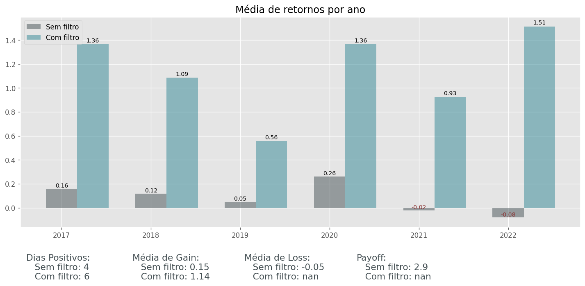

# Setup das Sombras

A ideia desse setup é utilizar somente as sombras do candles para tomada de decisão,
para isso fizemos um cálculo para pegar as sombras de cima e de baixo do candle. E após isso fizemos um ratio 
com a sombra de superior e a inferior.

Foi gerado alguns gráficos comparativos da estratégia com filtro e sem filtro e um gráfico com o acumulado 
e o drawdown.

* Comparativo entre dias do mês

* Comparativo entre dias da semana

* Comparativo entre os anos

* Resultado final

